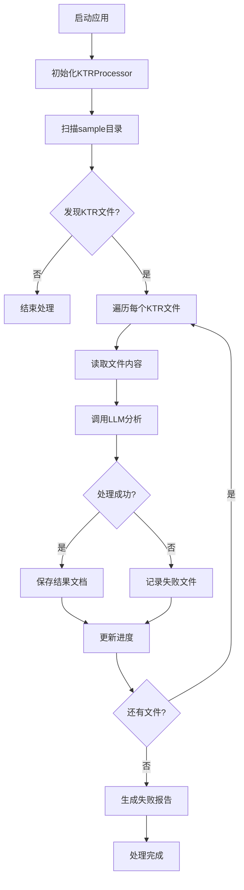

# LLM-KTR-Lineage 功能链路文档

## 总体功能流程



## 详细功能模块

### 1. 应用启动 (`main()`)
- **输入**: 无
- **输出**: 处理结果统计
- **流程**:
  1. 初始化日志系统
  2. 创建KTRProcessor实例
  3. 执行批量处理
  4. 捕获并记录异常

### 2. 文件发现 (`find_ktr_files()`)
- **输入**: 目录路径 (默认: `./sample`)
- **输出**: KTR文件路径列表
- **流程**:
  1. 验证目录存在性
  2. 使用glob模式查找`.ktr`文件
  3. 返回文件路径列表
  4. 记录发现的文件数量

### 3. 单文件处理 (`process_single_file()`)
- **输入**: KTR文件路径
- **输出**: LLM响应内容或None
- **流程**:
  1. 读取文件内容 (UTF-8编码)
  2. 调用LLM智能体进行分析
  3. 提取响应结果
  4. 保存到输出目录
  5. 记录使用统计

### 4. 批量处理 (`process_all_files()`)
- **输入**: 无
- **输出**: 处理统计信息
- **流程**:
  1. 获取所有KTR文件
  2. 初始化进度条
  3. 异步处理每个文件
  4. 更新进度显示
  5. 生成失败报告

### 5. 错误处理 (`write_failed_report()`)
- **输入**: 失败文件列表
- **输出**: `fail.md`报告文件
- **流程**:
  1. 创建失败报告文件
  2. 写入失败文件列表
  3. 记录失败统计

## 关键业务逻辑

### KTR文件解析
- **输入**: XML格式的KTR文件
- **处理**: LLM智能体分析字段映射关系
- **输出**: Markdown格式的字段映射表

### 字段映射格式
```markdown
| 源字段 | 目标字段 | 变换路径 | 变换类型 | 变换说明 |
|--------|----------|----------|----------|----------|
| field1 | target1  | step1    | transform| 描述     |
```

### 异步处理机制
- 使用`asyncio`实现并发处理
- 每个文件独立处理，互不影响
- 进度条实时显示处理状态

## 配置管理

### 环境变量配置
- `API_ENDPOINTS`: LLM API端点
- `API_TOKEN`: API访问令牌
- `MODEL_NAME`: 使用的模型名称
- `SYSTEM_PROMPT`: 系统提示词

### 日志配置
- **应用日志**: `app.log` (10MB轮转，保留7天)
- **错误日志**: `error.log` (10MB轮转，保留30天)
- **日志级别**: INFO (应用日志), ERROR (错误日志)

## 性能考虑

### 并发处理
- 异步I/O避免阻塞
- 单文件失败不影响整体进度
- 内存友好的流式处理

### 错误恢复
- 失败文件单独记录
- 详细的错误信息
- 可重试的处理机制